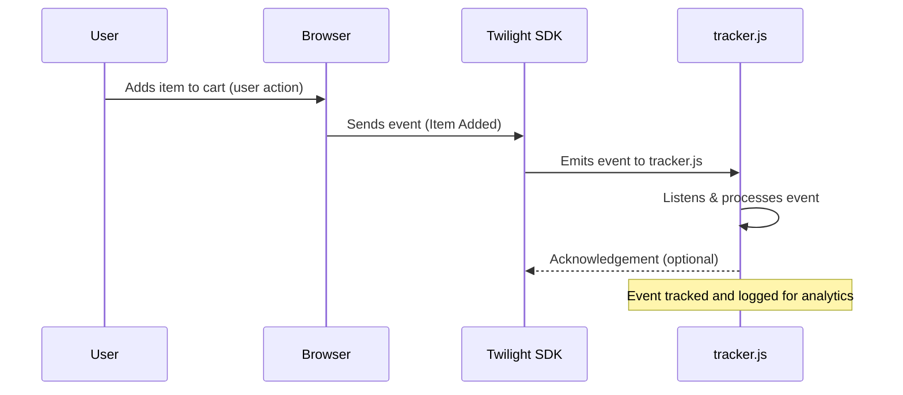
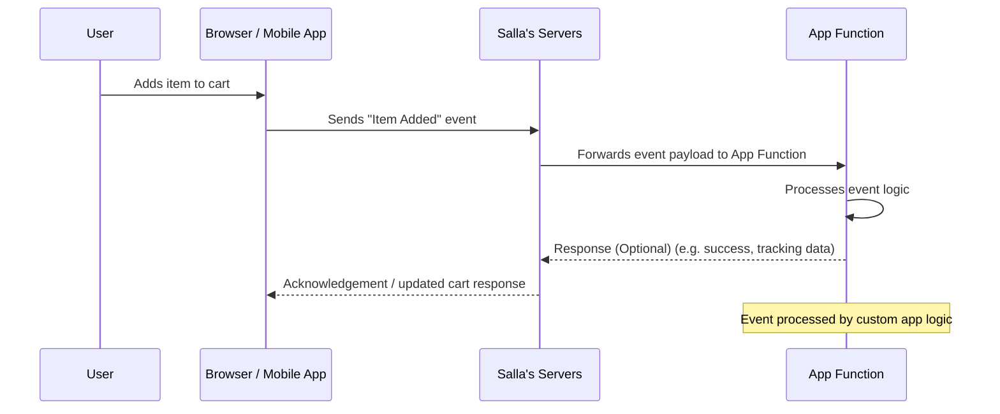

# E-commerce Events Overview

E-commerce events allow you to track and respond to customer actions throughout their shopping journey—from browsing products to completing a purchase. By capturing these events, developers can build applications that react to real user behavior, personalize shopping experiences, optimize marketing workflows, and automate backend processes.

## Integration Modes

Salla's e-commerce event system supports two integration modes:

- **Device Mode** — events sent from the customer's device to your callback endpoint via `tracker.js`
- **Cloud Mode via [App Functions](https://docs.salla.dev/1726817m0.md)** — events delivered server-to-server from Salla to your backend

### Device Mode

Events are sent directly from the customer's device (browser or mobile app) to your callback endpoint using a `tracker.js` script embedded in the storefront frontend. The script captures user interactions in real time and forwards them to your application.

**Best for:**
- Real-time client-side tracking
- Analytics and behavioral insights
- Personalization features
- Marketing and attribution tools

Implementation: **[Usage – Device Mode](https://docs.salla.dev/1724504m0.md)**

### Cloud Mode (App Functions)

Events are delivered directly from Salla's servers to your backend using **[App Functions](https://docs.salla.dev/1726817m0.md)**. This server-to-server approach removes the need for client-side scripts and ensures reliable, secure delivery.

**Best for:**
- Order processing and fulfillment
- Data synchronization
- Backend automation
- Advanced analytics pipelines

Implementation: **[Usage – Cloud Mode](https://docs.salla.dev/1724667m0.md)**

### Mode Comparison

| Mode            | Processing Location         | Best For                                       |
| --------------- | --------------------------- | ---------------------------------------------- |
| **Device Mode** | Client-side (`tracker.js`)  | Analytics, personalization, marketing tracking |
| **Cloud Mode**  | Server-side (App Functions) | Automation, integrations, backend workflows    |

---

## Event Lifecycle

### Device Mode Lifecycle

1. User performs an action in the storefront (e.g. adds product to cart).
2. Browser triggers the event through the **Twilight SDK**.
3. SDK emits the event to the `tracker.js` script embedded in the storefront.
4. Script listens for the event and processes it (analytics, tracking, personalization).
5. Script optionally acknowledges the event.

### Cloud Mode Lifecycle

1. User performs an action in the storefront.
2. Client sends the event to **Salla's servers**.
3. Platform forwards the event payload to your configured **App Function**.
4. Function executes custom logic (automation, integrations, data processing).
5. Function optionally returns a response to the platform.

